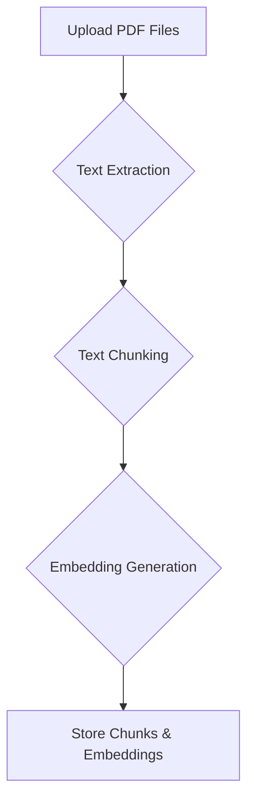
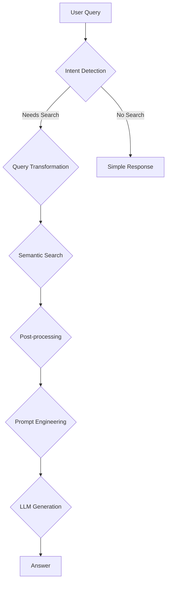

# RAG Mistral Backend (Assignment #4)

Python backend for Retrieval-Augmented Generation (RAG) using Mistral AI to build a searchable knowledge base from PDF documents.

## System Design

Two main pipelines: **Ingestion** and **Querying**.

### Ingestion Pipeline

Processes PDF files and prepares them for retrieval.



1.  **Upload PDF Files**: FastAPI endpoint accepts multiple PDF files
2.  **Text Extraction**: Extract text content from PDF files
3.  **Text Chunking**: Split text into smaller chunks for better retrieval granularity
4.  **Embedding Generation**: Convert chunks to vector embeddings via Mistral AI API
5.  **Storage**: Store chunks and embeddings in local file system

### Querying Pipeline

Answers user questions using the ingested knowledge base.



1.  **User Query**: Accept question via API endpoint
2.  **Intent Detection**: Identify greetings to bypass search for simple responses
3.  **Query Transformation**: Optimize query for better semantic matching
4.  **Semantic Search**: Find relevant chunks using cosine similarity
5.  **Post-processing**: Rank and merge search results
6.  **Prompt Engineering**: Construct context-aware prompt with retrieved information
7.  **LLM Generation**: Generate answer using Mistral AI language model
8.  **Response**: Return generated answer with source chunks

## Setup

1. Create `.env` file in the project root:
   ```
   MISTRAL_API_KEY=your_mistral_api_key_here
   ```

2. Install dependencies:
   ```bash
   pip install -r requirements.txt
   ```

3. Start the server:
   ```bash
   PYTHONPATH=. python3 -m uvicorn app.main:app --reload --host 0.0.0.0 --port 8000
   ```

## Testing

- Visit http://localhost:8000/docs for interactive API documentation
- Upload PDFs via `/ingest/` endpoint to build knowledge base
- Query knowledge base via `/query/` endpoint to ask questions
- Example: Upload Oracle 10Q.pdf, then ask "What is Oracle revenue?"

## API Endpoints

- **POST /ingest/**: Upload PDF files for ingestion
- **POST /query/**: Submit questions to query the knowledge base

## Dependencies

- [FastAPI](https://fastapi.tiangolo.com/) - Web framework for building APIs
- [Uvicorn](https://www.uvicorn.org/) - ASGI web server
- [Mistral AI](https://docs.mistral.ai/) - Language model and embeddings API
- [pypdf](https://pypdf.readthedocs.io/) - PDF text extraction
- [NumPy](https://numpy.org/) - Numerical computing for embeddings
- [python-dotenv](https://pypi.org/project/python-dotenv/) - Environment variable management
